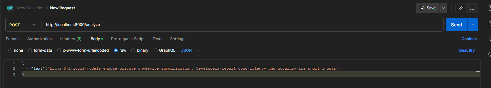

# LLM Knowledge Extractor – README

## Overview
LLM Knowledge Extractor is a FastAPI microservice that ingests unstructured text, summarizes it with an LLM (Ollama, OpenAI, Anthropic, or a mock), derives topics and sentiment, computes top‑3 noun keywords locally (rule‑based), and persists results to Supabase. It exposes two endpoints: `POST /analyze` and `GET /search?topic=...`.

---

## Prerequisites
- Python 3.11+
- A Supabase project (URL + anon/service key)
- Ollama

---

## Setup
1) **Clone & create virtualenv**
```bash
python -m venv .venv && source .venv/bin/activate  # Windows: .venv\\Scripts\\activate
```

2) **Install dependencies**
```bash
pip install -r requirements.txt
python -m spacy download en_core_web_sm || true
```

3) **Environment variables** (e.g., `.env` in project root)
```ini
SUPABASE_URL=your-project-url
SUPABASE_ANON_KEY=your-key
LLM_PROVIDER=ollama        
OLLAMA_BASE_URL=ollama-url-running-locally
OLLAMA_MODEL=llama3.2:8b
DEFAULT_LOCALE=en
```

4) **Create Supabase schema** (SQL editor)
```sql
create table if not exists analyses (
  id uuid primary key default gen_random_uuid(),
  created_at timestamptz not null default now(),
  title text,
  text text not null,
  summary text not null,
  topics jsonb not null,
  sentiment text not null check (sentiment in ('positive','neutral','negative')),
  keywords jsonb not null
);

create index if not exists idx_analyses_topics on analyses using gin (topics);
create index if not exists idx_analyses_keywords on analyses using gin (keywords);
```

---

## Run (local)
```bash
uvicorn main:app --reload --port 8000
```

### Quick test
```bash
curl -s -X POST http://localhost:8000/analyze \
  -H 'Content-Type: application/json' \
  -d '{"text":"OpenAI announced new features. Users report improved latency and better tooling for agents."}' | jq

curl -s "http://localhost:8000/search?topic=agents" | jq
```

Or you can test using **Postman**:


---

## API Reference
### POST `/analyze`
- **Body**: `{ "text": "..." }`
- **Response**: `{ id, title, summary, topics[3], sentiment, keywords[3] }`
- **Errors**: `400` on empty text. LLM failures fall back to rule‑based pipeline and still return 200.

### GET `/search?topic=xyz`
- Case‑insensitive match against `topics` and `keywords` arrays.

---

## Edge Cases & Robustness
- **Empty input** → `400` with a clear message.
- **LLM API failure** (network/auth/format) → automatic fallback: rule‑based summary, topics and sentiment so the request still succeeds and is persisted.

---

## Design Choices
- The service separates **deterministic, local logic** (noun keyword extraction) from **LLM‑dependent tasks** (summary/title/topics/sentiment) to keep costs predictable and results reproducible.
- **Supabase** (Postgres + JSONB + GIN indexes) for its lightweight Postgres + JSONB support with easy API access, and of course free option for this test.
- **llama3.1:8b** as the LLM for its strong open-weights performance that can run fully local via Ollama.
- **FastAPI** with Pydantic yields a compact, strongly‑typed interface, simple validation, and easy portability to Docker or serverless environments.

---

## Project structure

I followed that modular project structure to keep the codebase clean, maintainable, and scalable. Each concern (API, persistence, configuration, LLMs, etc.) lives in its own module, making debugging, testing, and future extensions much easier.

- `main.py`: Entry point; initializes FastAPI app and includes routes.

- `config.py`: Centralized environment/configuration management and Supabase client setup.

- `spacy_pipeline.py`: Loads optional spaCy NLP model for better tokenization and POS tagging.

- `data_models.py`: Defines Pydantic models for request validation and response schemas.

- `keyword_extract.py`: Implements rule-based keyword extraction from noun frequency.

- `fallback_sentiment.py`: Provides simple fallback logic for sentiment, topics, and summaries if the LLM fails.

- `llm.py`: Wrapper for different LLM providers (OpenAI, Anthropic, Ollama, or mock), ensuring consistent interface.

- `persistence.py`: Handles saving analyses and searching Supabase (Postgres) with JSONB queries.

- `api.py`: Defines API endpoints (/analyze, /search) and orchestrates calls to LLM, extractors, and persistence.

---

## Possible Improvements

While the current structure works well for a lightweight prototype, there are several areas that could be enhanced:

- **Comprehensive Docstrings**: Write clear, consistent docstrings for all functions and classes across the project, following a standard style (e.g., NumPy or Google docstring format). This would improve readability, maintainability, and make it easier for contributors and API consumers to understand the application’s functionality.

- **Folder Structure**: Instead of keeping all modules flat, I would create a dedicated folder structure to better separate concerns, e.g., authentication/, llms/, controllers/, services/, models/, etc. This would make the project easier to scale, test, and maintain in the long term.

- **Flexible LLM Orchestration**: Currently, one LLM provider is selected via environment variables. A future improvement would be to allow users of the API to switch between multiple LLMs per task. For example, running sentiment analysis with OpenAI, topic extraction with Claude, and summarization with a local Ollama model. This would enable more robust, cost-aware, and privacy-friendly workflows.

- **Testing & CI/CD**: Integrate unit tests, mocking for external APIs, and a CI/CD pipeline (GitHub Actions, GitLab CI).

- **Monitoring**: Add logging, request tracing, and metrics to improve observability in production.
